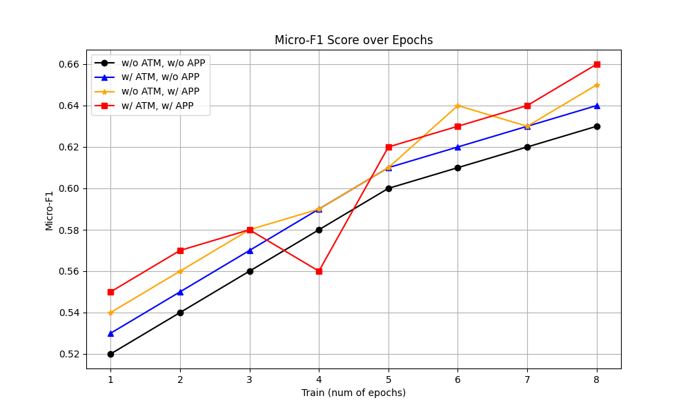
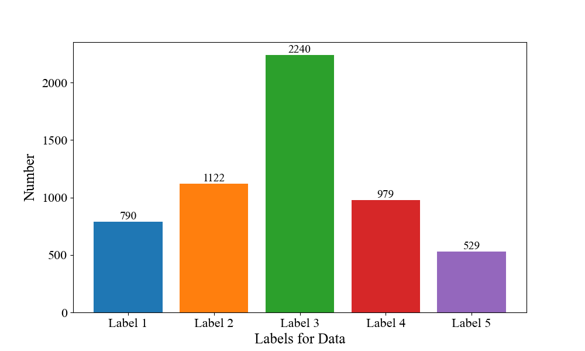
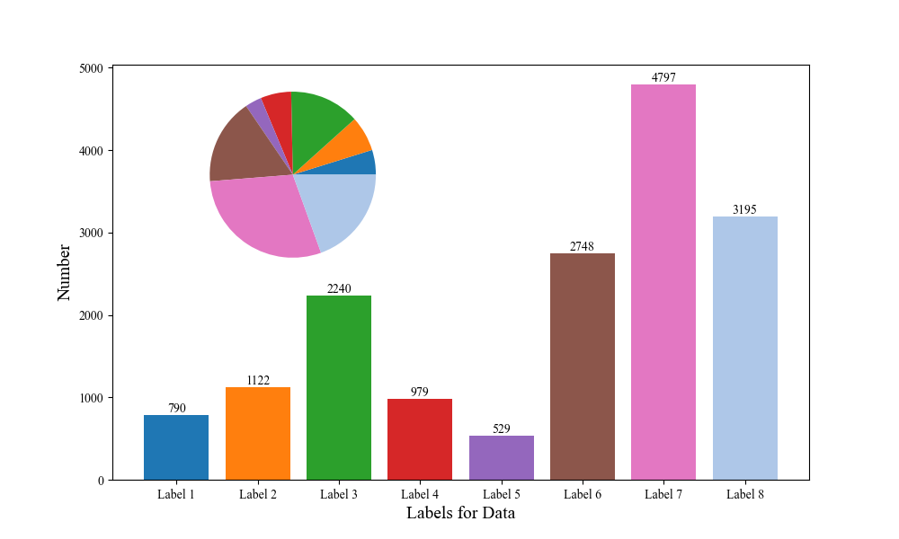
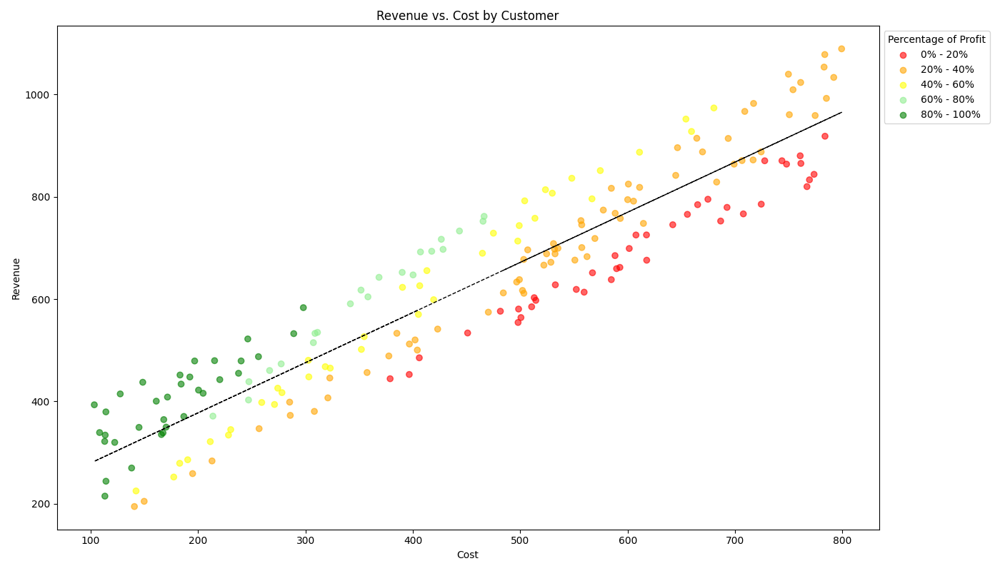
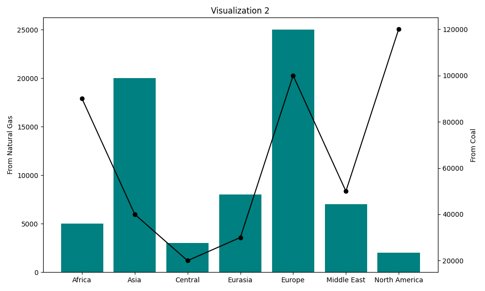
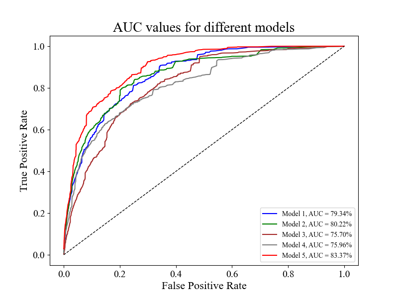
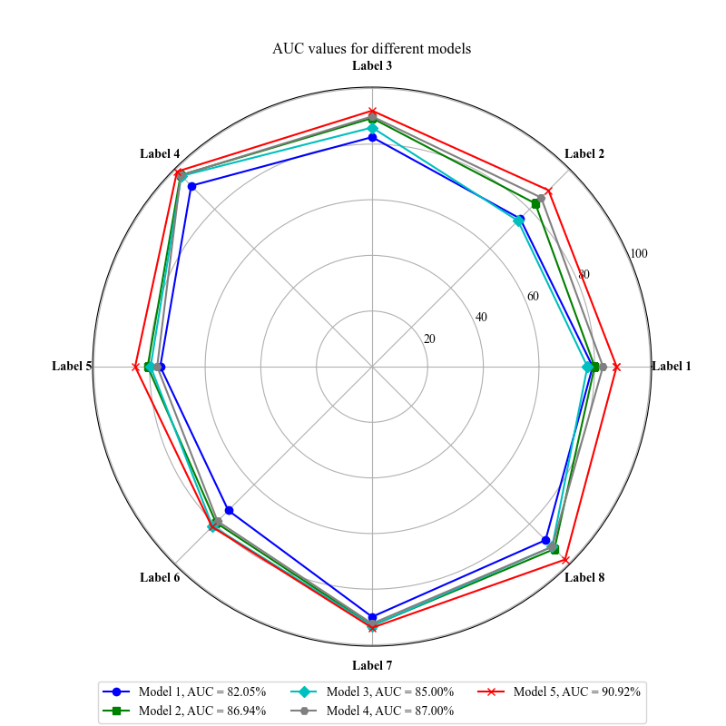
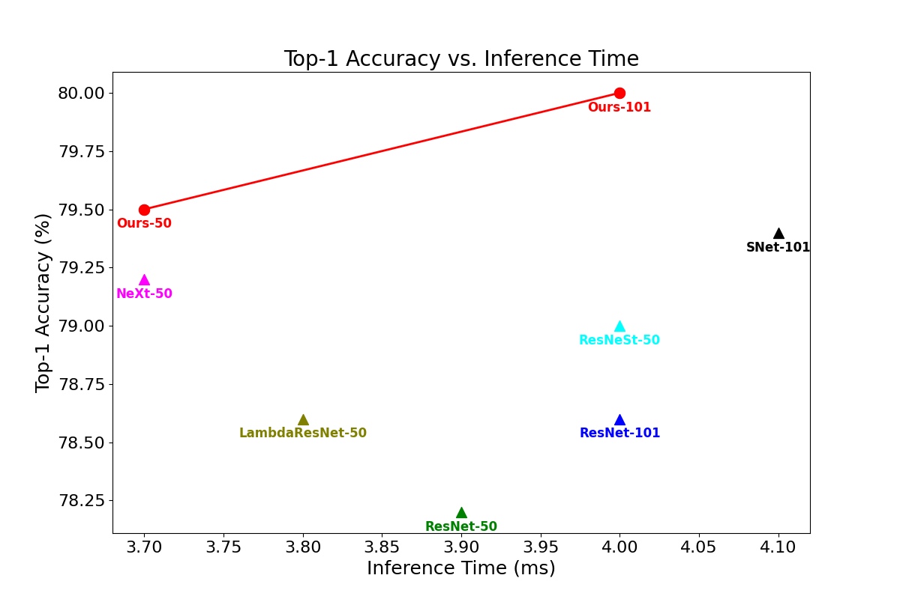
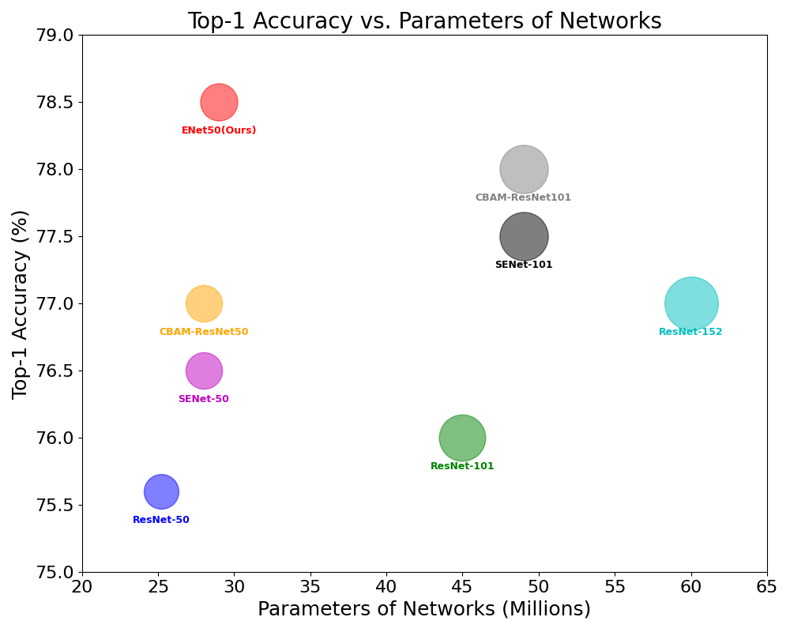

# 可视化
几种常用可视化图表类型。画图网站推荐 [微生信](https://www.bioinformatics.com.cn/)、[在线维恩图软件](https://online.visual-paradigm.com/cn/diagrams/features/venn-diagram-tool/)、[图标和海报](https://thenounproject.com/)，配色网站推荐 [Adobe Color](https://color.adobe.com/zh/explore)、[Dopely Color](https://colors.dopely.top/)、[uiGradients](https://uigradients.com/#LemonTwist)、[中国色](http://zhongguose.com/)、[Subcolor](https://subcolor.github.io/)和
[ColorDrop](https://colordrop.io/)

## 目录
- [折线图](#折线图)
- [柱状图](#柱状图)
- [带饼状图的柱状图](#带饼状图的柱状图)
- [散点图](#散点图)
- [双轴柱状和折线](#双轴柱状和折线)
- [ROC曲线和AUC](#roc曲线和auc)
- [雷达图](#雷达图)
- [推理时间和准确率的关系图](#推理时间和准确率的关系图)
- [模型参数和准确率的关系图](#模型参数和准确率的关系图)

这些图表类型各有特点，适用于不同的数据展示和分析场景。正确选择合适的图表类型可以帮助观众更好地理解和解读数据。

## 折线图
折线图是一种常用的数据可视化方法，适用于展示数据随时间或其他有序类别变化的趋势。

[Code](plt_line_chart.py)

 

## 柱状图

柱状图是一种常用的数据可视化方法，适用于展示不同类别的数据之间的比较。

[Code](bar.py)

 

## 带饼状图的柱状图

带饼状图的柱状图是一种数据可视化方法，它结合了柱状图和饼状图的特点，以提供更全面的数据分析。这种图表通常在柱状图的基础上加入一个或多个饼状图，用于展示额外的比例或分类信息。

[Code](bar_with_pie.py)

## 散点图
散点图是一种常用的数据可视化方法，适用于展示两个或多个变量间的关系，特别是确定变量之间是否存在相关性。

[Code](points.py)

## 双轴柱状和折线

- **用途**：用于比较两种不同量度或单位的数据。
- **特点**：结合了柱状图和折线图的特点，一个轴表示柱状图，另一个轴表示折线图，适用于展示相关但不同类型的信息。

[Code](double_line_chart.py)

## ROC曲线和AUC

- **用途**：用于评估二分类模型性能，特别是在不同阈值下的性能。
- **特点**：ROC曲线展示了在不同分类阈值下的真正例率与假正例率，AUC值量化了整个ROC曲线下的面积，提供了模型性能的总体评估。

[Code](draw_roc.py)

## 雷达图

- **用途**：用于显示多个定量变量的数据，常用于比较多个项目或时间点。
- **特点**：以从中心点出发的轴显示每个变量，数据点在每个轴上被标记并连接起来，形成一个多边形。

[Code](radar_chart.py)

## 推理时间和准确率的关系图

- **用途**：用于展示模型的推理时间（运行时间）与其准确率之间的关系。
- **特点**：通常使用散点图或线图，适用于评估和比较不同模型的性能和效率。

[Code](infrence_time_acc.py)

## 模型参数和准确率的关系图

- **用途**：用于展示模型参数（如网络深度、隐藏单元数量等）变化对模型准确率的影响。
- **特点**：可以使用散点图、线图或热力图，适用于模型选择和调优。

[Code](parameter_acc_buble.py)

