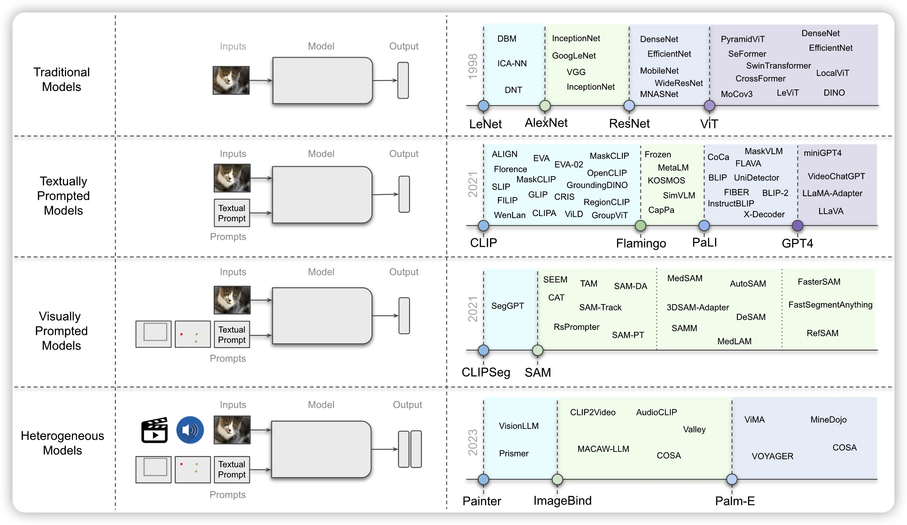

<h1 align="center">
项目介绍
</h1>

  <a href="#License">
  
  
  
  
  

- [前言](#前言)
- [目录](#目录)
- [我的公众号](#我的公众号)

## 前言
计算学习库主要包括基础学习资料、机器学习、深度学习、阅读论文笔记、个人及推荐项目源码、面试题和面经。

- 此项目的基础学习主要本人的学习笔记，包括C++、OpenCV、Docker等。
- 此项目是**机器学习、深度学习、CV面试**中常考到的**知识点和代码实现**，也是作为一个算法工程师必会的理论基础知识。
- 此项目深入研究计算机视觉领域的前沿论文，记录相关技术的发展和应用，以及分享对论文的评述和见解。阅读论文笔记关于CV方向的论文，也可能会有NLP方向的部分文章，主要目的是方便新手学习和自我回顾。
- 此项目整理计算机学习和计算机视觉领域常见的面试题，以及分享面试经验和技巧，帮助他人更好地准备面试。面试题和面经，以面试为主要目的，亦不可以篇概全，请谅解，有问题可提出。
- 此项目也包括自己的小项目和推荐的项目，仅供参考，也欢迎大家`Star`和`Fork`。

AI 科研入坑指南
- [赵鑫教授：科研入门的一些经验分享](https://mp.weixin.qq.com/s/h00VmCi1E7IhIDCj7X1ZjQ)

## 目录
> 本项目是当作自个儿的学习记录，包括软件安装、语言学习和阅读论文笔记。同时，也想记录一下个人面经及其他大牛面经。

- [基础知识学习](#基础知识学习)
- [机器学习](#机器学习)
- [深度学习](#深度学习)
- [计算机视觉](#计算机视觉)
- [自然语言处理](#NLP)
- [论文](#论文)
- [项目](#项目)
- [图像算法岗面经](#图像算法岗面经)
- [其他](#其他)

> 作为一个计算机视觉算法工程师，需要掌握的不仅是计算机编程知识，还需要掌握编程开发、机器学习/深度学习、图像识别/目标检测/语义分割、模型压缩、模型部署等知识点。

### 基础知识学习

深度学习基础的、C++ 编程及其他工具基础知识总结。

- [ ] 基础数学知识

📖 [深度学习500问](https://github.com/scutan90/DeepLearning-500-questions) ，以问答形式对常用的概率知识、线性代数、机器学习、深度学习、计算机视觉等热点问题进行阐述，以帮助自己及有需要的读者。

💻 [技术面试](https://github.com/CyC2018/CS-Notes)必备基础知识、Leetcode、计算机操作系统、计算机网络、系统设计。 

- [x] [快速学习OpenCV C++](0_BasicLearning/OpenCV_learning/README_CN.md)

	主要内容包括：环境配置和安装软件、读取读取图像、视频和摄像头、基本功能、调整大小和裁剪、绘制形状和文本、扭曲图像、颜色检测、形状轮廓检测、人脸检测、车牌识别。

- [ ] 模型压缩与量化
什么是模型压缩、模型剪枝、模型蒸馏、模型稀疏化？
1. 模型压缩和加速
2. 模型加速
3. 模型量化

- [ ] 模型部署

- [x] [Docker常用操作](0_BasicLearning/HelloDocker/README.md)

- [x] [Spark几个实验](0_BasicLearning/SparkDmo/README.md)

### 机器学习
- [ ] 机器学习
1. [莫烦机器学习相关教程](https://morvanzhou.github.io/tutorials)，[大佬🧍‍GitHub](https://github.com/MorvanZhou)。
2. kaggle一千多块奖牌获得者、世界上第一位kaggle四重大师编写的号称解决（几乎）所有机器学习问题代码书！[项目地址](https://github.com/abhishekkrthakur/approachingalmost)

### 深度学习
- [ ] 深度学习
1. [深度学习论文阅读路线图](https://github.com/floodsung/Deep-Learning-Papers-Reading-Roadmap)，适合任何渴望学习这项神奇技术的人！

### 计算机视觉
- [ ] 计算机视觉
### NLP
- [ ] NLP
1. [几乎最全的中文NLP资源库] (https://github.com/fighting41love/funNLP)  
2. NLP推荐项目知识图谱构建，自动问答，基于kg的自动问答。以疾病为中心的一定规模医药领域知识图谱，并以该知识图谱完成自动问答与分析服务。[https://github.com/liuhuanyong/QASystemOnMedicalKG](https://github.com/liuhuanyong/QASystemOnMedicalKG)

- HanLP项目: [HanLP](https://github.com/hankcs/HanLP)
> HanLP作者何晗老师的新书`《自然语言处理入门》`详细笔记！业界良心之作，书中不是枯燥无味的公式罗列，而是用白话阐述的通俗易懂的算法模型。从基本概念出发，逐步介绍**中文分词、词性标注、命名实体识别、信息抽取、文本聚类、文本分类、句法分析这几个热门问题的算法原理与工程实现。**

### 论文
- [ ] 论文（持续更新......）
- [x] [经典的Image classification和Object detection](5_Paper/CV-Paper/README_EN.md)
- [ ] 经典的Segmentation
- [ ] 综述

  论文: [Foundational Models Defining a New Era in Vision: A Survey and Outlook](5_Paper/Survey/Foundational_Models_Defining_a_New_Era_in_Vision-A_Survey_and_Outlook.pdf)。视觉基础模型: https://github.com/awaisrauf/Awesome-CV-Foundational-Models 

	

### 项目
- [ ] 项目（持续更新......）
- [颜色检测](#颜色检测)
- [目标跟踪](#目标跟踪)
- [行人检测](#行人检测)
- [手势识别](#手势识别)
- [情绪识别](#情绪识别)
- [车道线检测](#车道线检测)
- [车牌识别](#车牌识别)
- [MNIST手写数字分类](#MNIST手写数字分类)
- [人脸识别](#人脸识别)
- [口罩识别](#口罩识别)
- [交通灯检测](#交通灯检测) 

#### 颜色检测
从检测颜色到绿幕应用（用自定义视频或背景替换绿色背景），再到简单的照片编辑软件，构建颜色识别器是计算机视觉入门的一个很棒的项目。

项目地址：[https://github.com/mpatacchiola/deepgaze](https://github.com/mpatacchiola/deepgaze) 

#### 目标跟踪
一句话概括目标跟踪就是，根据先前的信息估计场景中存在目标的状态，可以使用一个对象（例如汽车）或多个对象（例如行人、动物等）的视频来构建简单的跟踪模型。

实际上，该模型执行两项任务：预测对象的下一个状态并根据对象的真实条件校正该状态。

项目地址：[https://github.com/JunweiLiang/Object_Detection_Tracking](https://github.com/JunweiLiang/Object_Detection_Tracking)

#### 行人检测
构建物体检测模型来检测行人是最简单（最烂大街）、最便捷的视觉项目之一。

只需要一个相关的高质量图像数据集和一个数据训练平台来训练和测试模型，稍微特殊点的场景需要标注，且免费的标注平台也很多

项目地址：[https://github.com/kuanhungchen/awesome-tiny-object-detection](https://github.com/kuanhungchen/awesome-tiny-object-detection)

#### 手势识别
手势识别是一项稍复杂点的计算机视觉任务，首先将手区域与背景分开，然后分割手指以预测手势。

项目地址：[https://github.com/ahmetgunduz/Real-time-GesRec](https://github.com/ahmetgunduz/Real-time-GesRec)

#### 情绪识别
如果决定完成更具挑战性的任务，可以考虑构建情绪检测模型。 将模型建立在六种主要的面部情绪之上：快乐、悲伤、愤怒、恐惧、厌恶和惊讶。

该项目的三个主要组成部分包括图像预处理、特征提取和特征分类。

项目地址：[https://github.com/atulapra/Emotion-detection](https://github.com/atulapra/Emotion-detection)

#### 车道线检测
无论是深度学习方法还是传统方法，就面试来看还会问到这些传统图像算法。

车道线检测主要用于自动驾驶，是一个有趣的初学者项目。

项目地址：[https://github.com/naokishibuya/car-finding-lane-lines](https://github.com/naokishibuya/car-finding-lane-lines)

#### 车牌识别

车牌识别是计算机视觉领域中OCR识别的应用之一，但是该项目存在两个挑战：数据收集和车牌格式因地区而异。

注意：车牌号被认为是敏感数据，因此在构建模型时请确保使用开源数据集。

一个简单的自动车牌识别系统可以使用基本的图像处理技术，比如使用 OpenCV。

然而，更进阶一点的使用物体检测器，如深度学习模型YOLO等。

项目地址：[OpenCV_learning C++版](0_BasicLearning/OpenCV_learning/Project_plate_recognition.cpp)或者[https://github.com/sergiomsilva/alpr-unconstrained](https://github.com/sergiomsilva/alpr-unconstrained)

#### MNIST手写数字分类
这个项目常常出现在新手教程中，是一个不错的上手项目，使用 MNIST 数据集构建一个简单的数字识别器。

当使用卷积神经网络训练模型时，将会在这其中学习如何开发、评估和使用卷积深度学习神经网络进行图像分类。

项目地址：[MOOC课程](6_Project/MNIST_Tensorflow/tensorflow-minsit_MOOC)或者[MNISTDemo](6_Project/MNIST_Tensorflow/MNISTDemo)或[GoogleCloudPlatform](https://github.com/GoogleCloudPlatform/tensorflow-without-a-phd/tree/master/tensorflow-mnist-tutorial)

#### 人脸识别
该项目的人脸识别是基于业内领先的C++开源库 `dlib`中的深度学习模型，用`Labeled Faces in the Wild人脸数据集`进行测试，有高达`99.38%`的准确率。但对小孩和亚洲人脸的识别准确率尚待提升。

该项目号称世界上最简洁的人脸识别库，操作简单，使用Python和命令行提取、识别、操作人脸。

项目地址：[https://github.com/ageitgey/face_recognition](https://github.com/ageitgey/face_recognition)

#### 口罩识别
该项目可以与嵌入式系统集成，应用于机场、火车站、办公室、学校和公共场所，以确保遵守公共安全准则。

项目地址：[https://github.com/AIZOOTech/FaceMaskDetection](https://github.com/AIZOOTech/FaceMaskDetection)

#### 交通灯检测
经典的交通灯检测任务，在智能交通领域得到应用。

项目地址：[https://github.com/erdos-project/pylot](https://github.com/erdos-project/pylot)

### 图像算法岗面经

🔎 互联网内推信息（社招、校招、实习）https://github.com/CyC2018/Job-Recommend 

- [ ] 图像算法岗面经
### 其他

- [ ] ChatGPT系列项目
1. ChatGPT：使用 Visual Foundation 模型进行对话、绘图和编辑[https://github.com/microsoft/TaskMatrix](https://github.com/microsoft/TaskMatrix)
- [ ] LLM大模型
- [x] [医学分类公开数据集](MedicalDatasets/README.md)
- [x] [数据分析笔试题集合](7_Interview/data_analysis/README.mdREADME.md)
- [ ] 工具
1. [Streamlit](https://streamlit.io/)是一个简单易用的Python库，可以帮助您快速创建交互式的数据应用程序和仪表板。
2. [Model Log ](https://github.com/NLP-LOVE/Model_Log)一款基于 Python3 的轻量级机器学习(Machine Learning)、深度学习(Deep Learning)模型训练评估指标可视化工具，与 TensorFlow、Pytorch、PaddlePaddle结合使用，可以记录模型训练过程当中的**超参数、Loss、Accuracy、Precision、F1值等，并以曲线图的形式进行展现对比**，轻松三步即可实现。

## 我的公众号
更多知识和最新博客，欢迎扫码关注我的公众号`进阶媛小吴`，记录我的成长之路，分享技术总结、读书笔记和个人感悟。

	

